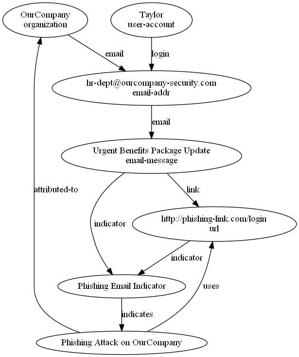
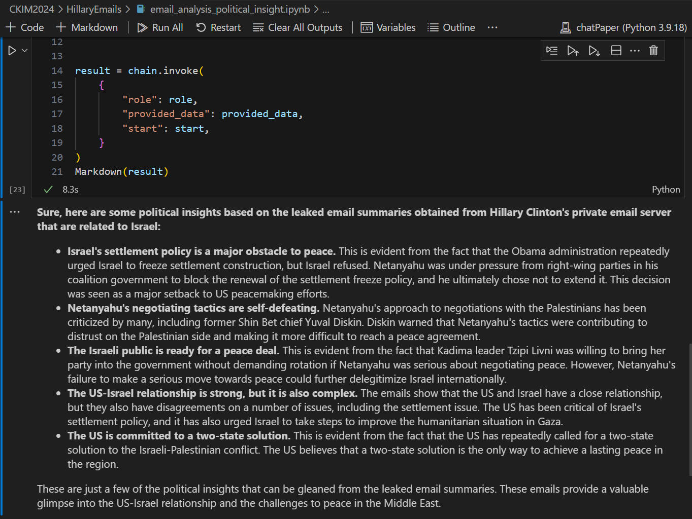

# Transforming Digital Forensics with Large Language Models

 

## Overview

In the pursuit of justice and accountability in the digital age, the integration of Large Language Models (LLMs) with digital forensics holds immense promise. This three-hour tutorial provides a comprehensive exploration of the transformative potential of LLMs in automating digital investigations and uncovering hidden insights.

Through a combination of real-world case studies, interactive exercises, and hands-on labs, participants will gain a deep understanding of how to harness LLMs for evidence analysis, entity identification, and knowledge graph reconstruction.

By fostering a collaborative learning environment, this tutorial aims to empower professionals, researchers, and students with the skills and knowledge needed to drive innovation in digital forensics. As LLMs continue to revolutionize the field, this tutorial will have far-reaching implications for enhancing justice outcomes, promoting accountability, and shaping the future of digital investigations.

---

## Date and Location

- Monday October 21, 2024
- ACM International Conference on Information and Knowledge Management (CIKM), Boise, USA, 2024

---

## Speakers

- Eric Xu, University of Maryland, College Park, Email: exu17288 at terpmail.umd dot edu
- Wenbin Zhang, Ph.D., Assistant Professor in AI, Florida International University, Email: wenbin.zhang at fiu dot edu
- Weifeng Xu, Ph.D., Professor in Cyber Forensics, University of Baltimore, Email: wxu at ubalt dot edu

---

## Table of Contents [PPT](CIKM2024_PPTs.pdf)

- Introduction
- [Forensic evidence entity recognition (hands-on lab)](#forensic-evidence-analysis)
  - [Evidence entity recognition](https://colab.research.google.com/github/frankwxu/digital-forensics-lab/blob/main/AI4Forensics/CKIM2024/PhishingAttack/PhishingAttackScenarioDemo/01_evidence_entity_recognition.ipynb)
  - [Visualize evidence and their relations](https://colab.research.google.com/github/frankwxu/digital-forensics-lab/blob/main/AI4Forensics/CKIM2024/PhishingAttack/PhishingAttackScenarioDemo/02_evidence_knowledge_dot_generator.ipynb)
- [Evidence knowledge graphs reconstruction (hands-on lab)](#forensic-evidence-analysis)
  - [Construct a knowledge graph in STIX (zero-shot)](https://colab.research.google.com/github/frankwxu/digital-forensics-lab/blob/main/AI4Forensics/CKIM2024/PhishingAttack/PhishingAttackScenarioDemo/03_evidence_stix_zeroshot.ipynb)
  - [Construct a knowledge graph in STIX (one-shot)](https://colab.research.google.com/github/frankwxu/digital-forensics-lab/blob/main/AI4Forensics/CKIM2024/PhishingAttack/PhishingAttackScenarioDemo/04_evidence_stix_oneshot.ipynb)
  - [Compare one-shot vs. zero-shot](https://colab.research.google.com/github/frankwxu/digital-forensics-lab/blob/main/AI4Forensics/CKIM2024/PhishingAttack/PhishingAttackScenarioDemo/05_evidence_stix_dot_generator.ipynb)
- Profiling suspect based on browser history (hands-on lab)
  - [Intro](https://colab.research.google.com/github/frankwxu/digital-forensics-lab/blob/main/AI4Forensics/CKIM2024/BrowserHistory/Eric/HistoryProfilingLLMsIntro.pptx)
  - [Profiling](https://colab.research.google.com/github/frankwxu/digital-forensics-lab/blob/main/AI4Forensics/CKIM2024/BrowserHistory/Eric/profile_browser_history_Eric.ipynb)
  - [Data Preprocessing](https://colab.research.google.com/github/frankwxu/digital-forensics-lab/blob/main/AI4Forensics/CKIM2024/BrowserHistory/Eric/profile_browser_history_Eric_dataprocess.ipynb)
  - [Student Practice](https://colab.research.google.com/github/frankwxu/digital-forensics-lab/blob/main/AI4Forensics/CKIM2024/BrowserHistory/Eric/HistoryProfilingLLMsLab.docx)
- [Political insights analysis based on Hillary's leaked Emails (hands-on lab)](#political-insight-analysis-leveraging-llms)
- Challenges and Limitations of Leveraging LLM in Digital Forensics
- Conclusion

---

### Forensic Evidence Analysis

The [Cyber incident report](PhishingAttack/PhishingAttackScenarioDemo/conversation.txt) documents a conversation between an IT Security Specialist and an Employee about an email phishing attack. We use LLMs to identify evidence entities and relationships and to construct digital forensic knowledge graphs.

Here is an example of a reconstructed digital forensics knowledge graph using an LLM only:

---

### Political Insight Analysis Leveraging LLMs

The case study demonstrates how to Leverage Large Language Models to gain political insight based on an email dataset. The dataset we have used in the case study is a set of leaked [emails](https://github.com/benhamner/hillary-clinton-emails?tab=readme-ov-file) obtained from Hillary Clinton's private email server.

The background of the leaked emails is a significant chapter in recent U.S. political history, involving questions of transparency, security, and the handling of sensitive information. During Hillary's tenure as U.S. Secretary of State from 2009 to 2013, Hillary Clinton used a private email server for her official communications instead of the official State Department email system. She stated that this was done for convenience, allowing her to use a single device for both personal and official emails.

The leaked email dataset from Hillary Clinton's private email server is a comprehensive collection of communications covering her entire tenure as Secretary of State from 2009 to 2013. It includes approximately 30,000 emails with a wide range of topics from official diplomatic communications to personal correspondences. The release and subsequent analysis of these emails have played a crucial role in political debates, legal inquiries, and public discussions about transparency and security in government communications.

Our dataset: [a set of email summaries](/AI4Forensics/CKIM2024/HillaryEmails/results_email_summary.txt). Each email summary is a summarization of an email generated by Gemini from an original email in the original leaked [email dataset](https://github.com/benhamner/hillary-clinton-emails?tab=readme-ov-file). We are only interested in emails containing the keyword "Israel".

Our results: [Code in Jupyter Notebook](/AI4Forensics/CKIM2024/HillaryEmails/email_analysis_political_insight.ipynb).

Here are some political insights based on the leaked email summaries obtained from Hillary Clinton's private email server that are related to Israel: 

---

Please cite our [paper](/papers/CIKM2024.pdf):

Eric Xu, Wenbin Zhang, and Weifeng Xu, "Transforming Digital Forensics with Large Language Models: Unlocking Automation, Insights, and Justice," in <em>Proceedings of the ACM International Conference on Information and Knowledge Management (CIKM), Boise, USA, October 21-25, 2024</em>

Honghe Zhou and Weifeng Xu and Josh Dehlinger and Suranjan Chakraborty and Lin Deng, "An LLM approach to gain cybercrime insights with evidence networks," in <em>Proceedings of the 20th Symposium on Usable Privacy and Security (SOUP 2024), Philadelphia, PA, August 11-13 2024</em>

Daniel Addai and Sarfraz Shaikh and Eric Xu and Wenbin Zhang and Xu, Weifeng, "A graph-based approach for discovering evidence relationships across multiple devices in group crimes," in <em>Proceedings of the 24th IEEE International Conference on Software Quality, Reliability, and Security (QRS2024-Fast Abstract), Cambridge, United Kingdom, July 1-5 2024</em>

---

