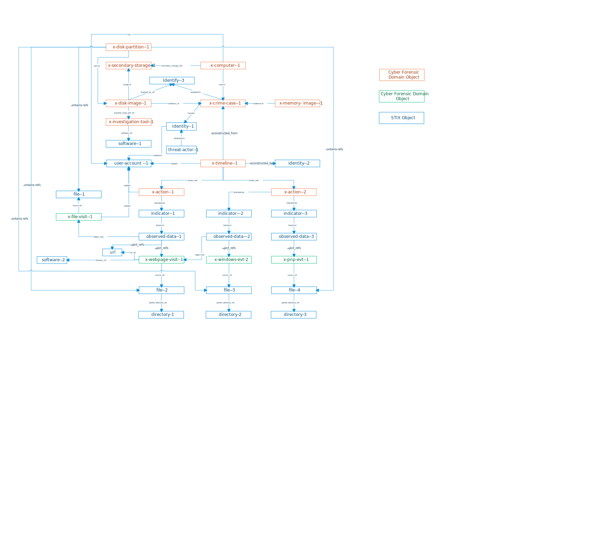

# STIX for Digital Forensics

## Objectives

The goal of the project is to explore and build an extended STIX™ (xSTIX) for exchanging Cyber Forensic Intelligence (CFI). While STIX focuses on understanding, responding to, and mitigating computer-based attacks, the xSTIX allows cyber forensics communities to better understand what and how digital evidence is left on hosts and networks during these attacks and to reconstruct digital forensic-based crime scenes after attacks. The reconstructed crime scenes along with the supporting evidence should be presentable and explainable in courts.

The xSTIX includes a set of Cyber Forensic Objects (CFOs), customized properties, and extended open vocabulary. They are categorized as follows:

- **Cyber Forensic Objects (CFOs)**

  - **Cyber Forensic Domain Objects (CFDOs):** CFDOs are CFI domain objects that are corresponding to concepts used in hosts and networks but are more intensively used for CFI, e.g., the concepts of disk image, file visit evidence, and webpage webpage visit evidence. A collection of CFDOs answer questions such as (1) how evidence is generated, collected, and stored, (2) who left evidence on disk images, (3) What cybercrime activities were performed? (4) What and how evidence does indicate these activities? Note that the concept of evidence plays a key role of CFI due to the natural of cyber forensic investigations. Evidence is log data resides on disks. The log data, in various forms, is often generated and used to meet functional or non-functional requirements of a feature/system originally. For example, the Windows security feature requires logging all security-related activities for auditing; Google drive records all files' status for a faster local and remote files synchronization. Cyber investigations often utilize these logs to reconstruct the behaviors of users. CFDOs are different from STIX Cyber-Observable Data objects because CFDOs are pre-processed data in the context of CFI instead of raw data that Cyber-observable Objects want to describe.

  - **Cyber Forensic Observable Objects (CFOOs):** CFOOs are similar to STIX SCOs. They are used to describe Cyber-observable Objects that frequently used for for CFI, e.g., a disk partition object represents the contents and structure of a disk segment.

- **Custom Properties to STIX objects:**: Customize properties of existing STIX objects to support forensic investigations. For example, registry value as the data may contain rich information that needs to be organized and formalized as digital evidence. The organized information will be formalized in new customized properties.

- **Open Vocabulary extension:** Add vocabulary in the field of cyber forensic investigations.

## CFO Graph



## Extension Format

- **CFOs:** We follow the STIX specification for [customizing objects](https://docs.oasis-open.org/cti/stix/v2.1/cs01/stix-v2.1-cs01.html#_p2sz1mp7z524). The most important rule to create a new object type is that the value of the type property in a Custom Object SHOULD start with “x-” followed by a source unique identifier (like a domain name with dots replaced by hyphens), a hyphen and then the name. For example, x-example-com-customobject.
- **Custom Properties:** We follow the [doc](https://docs.oasis-open.org/cti/stix/v2.1/cs01/stix-v2.1-cs01.html#_8072zpptza86).
- **Open Vocabulary extension:** We follow [open vocabulary extension](https://docs.oasis-open.org/cti/stix/v2.1/cs01/stix-v2.1-cs01.html#_bnnxah80y7by). Values that are not from the suggested vocabulary SHOULD be all lowercase and SHOULD use hyphens instead of spaces or underscores as word separators.

## Properites of CFOs

- [Required Properties for all CFOs (CFDOs and CFOOs)](https://docs.oasis-open.org/cti/stix/v2.1/cs01/stix-v2.1-cs01.html#_xzbicbtscatx)
  - **type** (string)： The value of this property MUST be one of CFOs.
  - **spec_version** (string): The current version is 2.1, i.e., **"spec_version": "2.1"**.
  - **id** (identifier): This id MUST meet the requirements of the identifier type [see STIX section 2.9](https://docs.oasis-open.org/cti/stix/v2.1/cs01/stix-v2.1-cs01.html#_64yvzeku5a5c).
- Additional Required Properties for CFDOs
  - **created** (timestamp): The created property represents the time at which the object was originally created by an investigator (i.e., object creator).
  - **modified** (timestamp): The modified property is only used by CFOs that support versioning and represents the time that this particular version of the object was last modified.
  - **created_by_ref**(identifier): The object creator is the entity (e.g., system, organization, instance of a tool) that generates the id property for a given object. It is optional in STIX SDO.
- [Common Properties used in all CFOs](https://docs.oasis-open.org/cti/stix/v2.1/cs01/stix-v2.1-cs01.html#_xzbicbtscatx)
  - **description** (string): A description that provides more details and context about the object.
  - **external_references** (list of type external-reference): The external_references property specifies a list of external references which refers to non-STIX information. This property is used to provide one or more URLs, descriptions, or IDs to records in other systems.

---

## Table of Contents (updating)

- Cyber Forensic Domain Objects (CFDOs)

  - [Image Object](#Image-Object)
  - [Investigation Tool Object](#Investigation-Tool-Object)
  - [Action Object](#Action-Object)
  - [Timeline Object](#Timeline-Object)
  - [Crime Case Object](#Crime-Case-Object)
  - [Investigator Object](#Investigator-Object)

- Cyber Forensic Observable Objects (CFOOs)

  - [Computer Object](#Computer-Object)
  - [Disk Partition Object](#Disk-Partition-Object)
  - [RAM Object](#RAM-Object)
  - [Secondary Storage Object](#Secondary-Storage-Object)
  - [Cloud Storage Object](#Cloud-Storage-Object)
  - [Windows Event Object](#Windows-Event-Object)
  - [Webpage Visit Object](#Webpage-Visit-Object)
  - [Plug and Play (PnP) Event Object](#Plug-and-Play-PnP-Event-Object)
  - [File Visit Object](#File-Visit-Object)
    - [RecentFileCache](#RecentFileCache)
    - [Shimcache](#Shimcache)
    - [UserAssist](#UserAssist)
    - [Prefetch](#Prefetch)
    - [USNJournal](#USNJournal)
    - [Shellbags](#Shellbags)
    - [Jumplist](#Jumplist)
    - [Lnk]($Lnk)
    - [RMU]($RMU)
    - [MFT]($MFT)
    - [AppLog](#AppLog)

- Property Extension
  - [Extension for Windows Registry Key Object](#Extension-for-Windows-Registry-Key-Object)
- Open Vocabulary extension
  - [threat-actor-type-ov extension](#threat-actor-type-ov-extension])
  - [ani-forensic-tool-type-ov](#tool-type-ov-extension)

## Image Object

**Type Name:** x-image

An image Object represent a computer file containing the contents and structure of a storage device, such as a hard disk drive, tape drive, floppy disk, optical disc, or USB flash drive, as well as RAM.

### Image Specific Properties

| Property Name      | Type                          | Description                                                           |
| ------------------ | ----------------------------- | --------------------------------------------------------------------- |
| type (required)    | string                        | The value of this property MUST be x-image.                           |
| image_id           | string                        | Specifies an id of an image.                                          |
| description        | string                        | Specifies the description of an image.                                |
| partitions         | list of type x-disk-partition | Specifies a list of partitions that an image contains.                |
| acquired_on        | timestamp                     | Specifies the time the image was acquired.                            |
| format             | open-vocab                    | Specifies the image format. It MUST come from x-disk-image-format-ov. |
| acquired_using_ref | identifier                    | Specifies the Investigation Tool that creates the image.              |
| acquired_by_ref    | identifier                    | Specifies the Investigator that create a disk image.                  |
| image_file_ref     | identifier                    | Specifies a image file.                                               |

### Relationships

| Source  | Relationship Type | Target                     | Description                                                                            |
| ------- | ----------------- | -------------------------- | -------------------------------------------------------------------------------------- |
| x-image | evidence-of       | x-crime-case               | This Relationship describes that an Image is an evidence of a Crime Case.              |
| x-image | image-of          | x-secondary-Storage, x-ram | This Relationship describes that an Image is an image of a Secondary Storage or a RAM. |

### Disk Image Format Vocabulary

**Vocabulary Name:** x-image-format-ov

| Vocabulary Value | Description                                                                                                                     |
| ---------------- | ------------------------------------------------------------------------------------------------------------------------------- |
| e01              | Encase Evidence image file format                                                                                               |
| dd               | A bit-of-bit copy of the raw data file                                                                                          |
| lef              | Encase Logical Evidence files                                                                                                   |
| zip              | It is an archival forensic image file format that supports lossless data compression without losing the originality of the data |
| dmg              | A disk image file that is generally created by the Apple Mac OS X                                                               |
| other            |                                                                                                                                 |

### Examples

```json
[
  {
    "type": "x-image",
    "spec_version": "2.1",
    "id": "x-image--87a3e4ee-102c-4cc9-9017-96089a0e0680",
    "acquired_on": "2021-01-06T20:03:22.000Z",
    "format": "dd",
    "image_file_ref": "file--6e735550-51e8-483a-b0d6-29d6ff5cfbf3",
    "acquired_by_ref": "x-investigator--b9babea0-63eb-4981-8e6d-f6603cf7e46a",
    "acquired_using_ref": "x-investigation-tool--0a5b5f22-ba62-42f1-9d74-a94e87f4b45c",
    "created_by_ref": "identity--f431f809-377b-45e0-aa1c-6a4751cae5ff",
    "created": "2021-04-06T20:03:00.000Z",
    "modified": "2021-04-06T20:03:00.000Z"
  },
  {
    "type": "relationship",
    "spec_version": "2.1",
    "id": "relationship--014841f8-eb38-4673-9904-70f67c92dd8b",
    "created": "2020-01-16T18:52:24.277Z",
    "modified": "2020-01-16T18:52:24.277Z",
    "relationship_type": "evidence-of",
    "source_ref": "x-image--87a3e4ee-102c-4cc9-9017-96089a0e0680",
    "target_ref": "x-crime-case--68f0b7d5-f7ab-47d2-8773-739ceb1c11bb"
  },
  {
    "type": "relationship",
    "spec_version": "2.1",
    "id": "relationship--014841f8-eb38-4673-9904-70f67c92dd8b",
    "created": "2020-01-16T18:52:24.277Z",
    "modified": "2020-01-16T18:52:24.277Z",
    "relationship_type": "image-of",
    "source_ref": "x-image--87a3e4ee-102c-4cc9-9017-96089a0e0680",
    "target_ref": "x-secondary-Storage--3d3c0888-eab4-40a7-8b8a-c195b3d87c19"
  }
]
```

## Investigation Tool Object

**Type Name:** x-investigation-tool

Investigation Tools are software that can be used by cyber investigators to perform digital forensic investigations. This CFO MUST NOT be used to characterize malware and SDO tools.

### Investigation Tool Specific Properties

| Property Name   | Type                    | Description                                                                                                                                                         |
| --------------- | ----------------------- | ------------------------------------------------------------------------------------------------------------------------------------------------------------------- |
| type (required) | string                  | The value of this property MUST be x-investigation-tool.                                                                                                            |
| last_modified   | timestamps              | The last modified date of the investigation tool.                                                                                                                   |
| description     | string                  | A description that provides more details and context about the investigation tool.                                                                                  |
| functions       | list of type open-vocab | Specifies a list of functions of an Investigation Tool. Each function is summarized in one activity, which SHOULD come from the x-activity-name-ov open vocabulary. |
| aliases         | list of type string     | Alternative names used to identify this investigation tool.                                                                                                         |
| version         | string                  | The version identifier associated with the investigation tool.                                                                                                      |
| software_ref    | identifier              | Specifies the software product (if CPE or SWID is known) used as the investigation tool.                                                                            |

### Activity Name Vocabulary

The Activity Name vocabulary is shared by both attackers and investigators.

**Vocabulary Name**: x-activity-name-ov

| Vocabulary Value | Description                                                         |
| ---------------- | ------------------------------------------------------------------- |
| steganalysis     |                                                                     |
| browse           |                                                                     |
| carve            |                                                                     |
| config           |                                                                     |
| copy             |                                                                     |
| connect          |                                                                     |
| create           | Create a file , artifact, and directory.                            |
| decode           |                                                                     |
| decrypt          | Perform decryption tasks.                                           |
| delete           |                                                                     |
| disconnect       |                                                                     |
| download         | Download files.                                                     |
| dump             | Dump information from cache or memory.                              |
| encode           | Decode data in a readable form                                      |
| execute          |                                                                     |
| encrypt          |                                                                     |
| extract          | Extract information from file systems.                              |
| format           | Format disks.                                                       |
| hide             | Hide information.                                                   |
| install          | Install software.                                                   |
| login            |                                                                     |
| logout           |                                                                     |
| modify           |                                                                     |
| mount            |                                                                     |
| obfuscate        |                                                                     |
| other            |                                                                     |
| plug-hardware    |                                                                     |
| power-off        |                                                                     |
| power-on         |                                                                     |
| parse            | Parse content of files, including registry parsers and log parsers. |
| read             |                                                                     |
| receive          |                                                                     |
| rename           |                                                                     |
| record           |                                                                     |
| recover          |                                                                     |
| request          |                                                                     |
| response         |                                                                     |
| save             |                                                                     |
| send             |                                                                     |
| search           | Search for strings, including key words, files, and directories.    |
| uninstall        |                                                                     |
| unplug-hardware  |                                                                     |
| unknown          |                                                                     |
| unmount          |                                                                     |
| update           |                                                                     |
| verify           |                                                                     |
| add              |                                                                     |

### Examples

Use an open-source software to parse and decode $LogFile records

```json
{
  "type": "x-investigation-tool",
  "spec_version": "2.1",
  "id": "x-investigation-tool--c65a985d-dc31-441e-840b-54381cef4e31",
  "name": "LogFileParser",
  "used_for": ["decode", "parse"],
  "description": "This program decodes and parses $LogFile records and transaction entries.",
  "external_references": [
    {
      "source_name": "LogFileParser",
      "url": "https://github.com/jschicht/LogFileParser"
    }
  ]
}
```

## Action Object

**Type Name:** x-action

An action is one cyber criminal activity performed under a user account. It is a meaningful ACID (Atomicity, Consistency, Isolation, Durability) activity related to file systems or a hardware component.

## Action Specific Properties

| Property Name   | Type       | Description                                                                                   |
| --------------- | ---------- | --------------------------------------------------------------------------------------------- |
| type (required) | string     | The value of this property MUST be x-action.                                                  |
| name            | open-vocab | Specifies the name of an action. It MUST come from x-activity-name-ov.                        |
| target          | identifier | Specifies the object that receives the direct action of the verb. It is an observable object. |
| description     | string     | A description that provides more details and context about the Action.                        |
| start_time      | timestamp  | Specifies the the time that an action is started.                                             |
| end_time        | timestamp  | Specifies the the time that an action is ended.                                               |

### Relationships

| Source   | Relationship Type | Target       | Description                                                             |
| -------- | ----------------- | ------------ | ----------------------------------------------------------------------- |
| x-action | exploits          | user-account | This Relationship describes that a Action exploits a User Account.      |
| x-action | indicated-by      | indicator    | This Relationship describes that a Action is indicated-by of Indicator. |

## Example: An action that search for anti-forensics tools

```json
[
  {
    "type": "x-action",
    "spec_version": "2.1",
    "id": "x-action--87a3e4ee-102c-4cc9-9017-96089a0e0680",
    "name": "Search",
    "target": "anti-forensic tools",
    "description": "Search a 'anti-forensic tools' keyword online using bing search engine.",
    "start_time": "2015-25-25T14:46:44:44Z",
    "created_by_ref": "identity--f431f809-377b-45e0-aa1c-6a4751cae5ff",
    "created": "2021-04-06T20:03:00.000Z",
    "modified": "2021-04-06T20:03:00.000Z"
  },
  {
    "type": "indicator",
    "spec_version": "2.1",
    "id": "indicator--8e2e2d2b-17d4-4cbf-938f-98ee46b3cd3f",
    "created_by_ref": "identity--f431f809-377b-45e0-aa1c-6a4751cae5ff",
    "created": "2016-04-06T20:03:48.000Z",
    "modified": "2016-04-06T20:03:48.000Z",
    "name": "Search indicator",
    "description": "Indication of search keyword",
    "pattern": "[x-webpage-visit:url_ref MATCHES 'bing.com/search?q=anti-forensic+tools']",
    "pattern_type": "stix",
    "valid_from": "2016-01-01T00:00:00Z"
  },
  {
    "type": "x-webpage-visit",
    "spec_version": "2.1",
    "id": "x-webpage-visit--8e2e2d2b-17d4-4cbf-938f-98ee46b3cd3f",
    "url_ref": "url--9cc5a5dc-0acd-46f5-ae3f-724370087622",
    "visit-time": "2015-25-25T14:46:44:44Z",
    "visit-count": 2,
    "browser_ref": "software--b67a8d52-d438-4ace-8285-c6d485e34192",
    "user_account_ref ": "user-account--68f0b7d5-f7ab-47d2-8773-739ceb1c11bb",
    "source_ref": "file--843f6a43-0603-4e0d-84a4-198386eecf4f",
    "created_by_ref": "identity--f431f809-377b-45e0-aa1c-6a4751cae5ff",
    "created": "2014-04-06T20:03:00.000Z",
    "modified": "2014-04-06T20:03:00.000Z"
  },
  {
    "type": "relationship",
    "spec_version": "2.1",
    "id": "relationship--014841f8-eb38-4673-9904-70f67c92dd8b",
    "created": "2020-01-16T18:52:24.277Z",
    "modified": "2020-01-16T18:52:24.277Z",
    "relationship_type": "exploits",
    "source_ref": "x-action--87a3e4ee-102c-4cc9-9017-96089a0e0680",
    "target_ref": "user-account--68f0b7d5-f7ab-47d2-8773-739ceb1c11bb"
  },
  {
    "type": "relationship",
    "spec_version": "2.1",
    "id": "relationship--979e202f-8b68-43e6-beb7-06d26d88a352",
    "created": "2020-01-16T18:52:24.277Z",
    "modified": "2020-01-16T18:52:24.277Z",
    "relationship_type": "indicated-by",
    "source_ref": "x-action--87a3e4ee-102c-4cc9-9017-96089a0e0680",
    "target_ref": "indicator--8e2e2d2b-17d4-4cbf-938f-98ee46b3cd3f"
  },
  {
    "type": "relationship",
    "spec_version": "2.1",
    "id": "relationship--46ed253f-352e-4ff6-9531-fc37a192773b",
    "created": "2020-01-16T18:52:24.277Z",
    "modified": "2020-01-16T18:52:24.277Z",
    "relationship_type": "based-on",
    "source_ref": "indicator--8e2e2d2b-17d4-4cbf-938f-98ee46b3cd3f",
    "target_ref": "observed-data--8943c5f4-5c32-4a92-a7f2-8ab340483e64"
  },
  {
    "type": "observed-data",
    "spec_version": "2.1",
    "id": "observed-data--8943c5f4-5c32-4a92-a7f2-8ab340483e64",
    "created": "2020-01-16T18:52:24.277Z",
    "modified": "2020-01-16T18:52:24.277Z",
    "first_observed": "2020-01-16T18:52:24.277Z",
    "last_observed": "2020-01-16T18:52:24.277Z",
    "number_observed": 1,
    "object_refs": ["x-webpage-visit--8e2e2d2b-17d4-4cbf-938f-98ee46b3cd3f"]
  }
]
```

## Example: Install ccleaner tool

```json
[
  {
    "type": "x-action",
    "spec_version": "2.1",
    "id": "x-action--87a3e4ee-102c-4cc9-9017-96089a0e0680",
    "name": "install",
    "target": "tool--8e2e2d2b-17d4-4cbf-938f-98ee46b3cd3f",
    "description": "Install ccleaner anti-forensic tool",
    "start_time ": "2015-25-25T14:46:44:44Z",
    "created_by_ref": "identity--f431f809-377b-45e0-aa1c-6a4751cae5ff",
    "created": "2021-04-06T20:03:00.000Z",
    "modified": "2021-04-06T20:03:00.000Z"
  },
  {
    "type": "relationship",
    "spec_version": "2.1",
    "id": "relationship--979e202f-8b68-43e6-beb7-06d26d88a352",
    "created": "2020-01-16T18:52:24.277Z",
    "modified": "2020-01-16T18:52:24.277Z",
    "relationship_type": "indicated-by",
    "source_ref": "x-action--87a3e4ee-102c-4cc9-9017-96089a0e0680",
    "target_ref": "indicator--f919a8eb-c8e1-48b1-93ef-df75c6f73c7e"
  }
]
```

# Timeline Object

**Type Name:** x-timeline

A Timeline object describes a specific cybercrime case that is represented by a sequence of actions performed by a threat-actor in chronological order.

## Timeline Specific Properties

| Property Name      | Type                  | Description                                                            |
| ------------------ | --------------------- | ---------------------------------------------------------------------- |
| type (required)    | string                | The value of this property MUST be x-timeline.                         |
| action_refs        | list of type x-action | Specifies a list of actions in chronological order.                    |
| name               | string                | Specifies the name of a timeline.                                      |
| description        | string                | A description that provides more details and context about a timeline. |
| reconstructed_from | identifier            | Specifies timeline is reconstructed from a crime case.                 |
| reconstructed_by   | identifier            | Specifies timeline is reconstructed by an identity.                    |

### Relationships

| Source     | Relationship Type | Target       | Description                                                          |
| ---------- | ----------------- | ------------ | -------------------------------------------------------------------- |
| x-timeline | exploits          | user-account | This Relationship describes that a Timeline exploits a User Account. |

## Example: data leakage using a UBS

```json
[
  {
    "type": "x-timeline",
    "spec_version": "2.1",
    "id": "x-timeline--5e54d8e8-1c4b-4a16-bb1b-7ab2acb06fff",
    "name": "data leakage using a UBS",
    "description": "An threat actor uses a USB to transfer files.",
    "action_refs": [
      "x-action--6ba0fce7-1ff9-44a4-9fbb-28760afc7827",
      "x-action--83aee86d-1523-4111-938e-8edc8a6c804f"
    ],
    "reconstructed_from": "x-crime-case--49aadd9f-8bb0-4728-bd56-7bc708714516",
    "exploits": "user-account-2485b844-4efe-4343-84c8-eb33312dd56f",
    "created_by_ref": "identity--f431f809-377b-45e0-aa1c-6a4751cae5ff",
    "created": "2021-04-06T20:03:00.000Z",
    "modified": "2021-04-06T20:03:00.000Z"
  }
]
```

# Crime Case Object

**Type Name:** x-crime-case

A Crime Case object represents a background description of a potential cybercrime case given to a cyber forensics investigator.

## Crime Case Properties

| Property Name   | Type              | Description                                                                                      |
| --------------- | ----------------- | ------------------------------------------------------------------------------------------------ |
| type (required) | string            | The value of this property MUST be x-crime-case.                                                 |
| case_id         | string            | Specifies a case identifier that is assigned to a case.                                          |
| name            | string            | Specifies the name of a case.                                                                    |
| description     | string            | A description that provides more details and context about a case.                               |
| case_file_refs  | list of type file | Specifies docs, logs, and any files (other than disk images) that are associated with the cases. |

### Relationships

| Source       | Relationship Type | Target         | Description                                                                 |
| ------------ | ----------------- | -------------- | --------------------------------------------------------------------------- |
| x-crime-case | assigned-to       | x-investigator | This Relationship describes that the Investigator was assigned to the case. |
| x-crime-case | involves          | identity       | This Relationship describes that a x-crime-case involves identity.          |

## Example: NIST data leakage case

```json
[
  {
    "type": "x-crime-case",
    "spec_version": "2.1",
    "id": "x-crime-case--5e54d8e8-1c4b-4a16-bb1b-7ab2acb06fff",
    "name": "NIST data leakage",
    "description": "The case study is provided by NIST.",
    "case_file_refs": "[file--6ba0fce7-1ff9-44a4-9fbb-28760afc7827, file--83aee86d-1523-4111-938e-8edc8a6c804f]",
    "created_by_ref": "identity--f431f809-377b-45e0-aa1c-6a4751cae5ff",
    "created": "2021-04-06T20:03:00.000Z",
    "modified": "2021-04-06T20:03:00.000Z"
  },
  {
    "type": "relationship",
    "spec_version": "2.1",
    "id": "relationship--6598bf44-1c10-4218-af9f-75b5b71c23a7",
    "created": "2021-05-15T09:12:16.432Z",
    "modified": "2021-05-15T09:12:16.432Z",
    "relationship_type": "involves",
    "source_ref": "x-crime-case--5e54d8e8-1c4b-4a16-bb1b-7ab2acb06fff",
    "target_ref": "identity--2485b844-4efe-4343-84c8-eb33312dd56f"
  },
  {
    "type": "relationship",
    "spec_version": "2.1",
    "id": "relationship--6598bf44-1c10-4218-af9f-75b5b71c23a7",
    "created": "2021-05-15T09:12:16.432Z",
    "modified": "2021-05-15T09:12:16.432Z",
    "relationship_type": "assigned-to",
    "source_ref": "x-crime-case--5e54d8e8-1c4b-4a16-bb1b-7ab2acb06fff",
    "target_ref": "x-investigator--6e775953-6fd3-4f0f-b1f2-d180e25f17dc"
  }
]
```

## Investigator Object

**Type Name:** x-investigator

An investigator is a digital forensic analyst to collect, store, and analyze digital evidence for reconstructing a crime scene.

### Investigator Specific Properties

| Property Name              | Type                    | Description                                                                                                                                 |
| -------------------------- | ----------------------- | ------------------------------------------------------------------------------------------------------------------------------------------- |
| type (required)            | string                  | The value of this property MUST be x-investigator.                                                                                          |
| name (required)            | string                  | A name used to identify this Investigator.                                                                                                  |
| description                | string                  | A description that provides more details and context about the Investigator, potentially including its purpose and its key characteristics. |
| degree                     | string                  | Specifies the highest academic degree of the investigator, e.g, AA, BS, MS, Ph.D.                                                           |
| major                      | string                  | Specifies the major of the highest academic degree of the investigator.                                                                     |
| school                     | string                  | Specifies the school the investigator graduated from.                                                                                       |
| certificates               | list of type string     | Specifies a list of certificates the investigator has.                                                                                      |
| has_investigated_case_refs | list of type identifier | Specifier a list of x-crime-case.                                                                                                           |

### Relationships

| Source         | Relationship Type | Target       | Description                                                                 |
| -------------- | ----------------- | ------------ | --------------------------------------------------------------------------- |
| x-investigator | attributed-to     | identity     | The relationship describes that the Investigator's identity.                |
| x-investigator | investigates      | x-crime-case | The relationship describes that the Investigator investigates a Crime Case. |

### Example

Describe a crime case investigator.

```json
[
  {
    "type": "x-investigator",
    "spec_version": "2.1",
    "id": "x-investigator--096e9478-2b7b-5bc9-a035-08464b16fc7b",
    "degree": "MS",
    "major": "Cyber Investigations",
    "history": [
      "x-crime-case--27e05525-53b8-479d-bd85-ba0e63193283",
      "x-crime-case--a3d3f2b8-79b0-4b76-8bb0-458692196125"
    ]
  },
  {
    "type": "relationship",
    "spec_version": "2.1",
    "id": "relationship--6598bf44-1c10-4218-af9f-75b5b71c23a7",
    "created": "2021-05-15T09:12:16.432Z",
    "modified": "2021-05-15T09:12:16.432Z",
    "relationship_type": "involves",
    "source_ref": "x-crime-case--5e54d8e8-1c4b-4a16-bb1b-7ab2acb06fff",
    "target_ref": "identity--2485b844-4efe-4343-84c8-eb33312dd56f"
  }
]
```

---

## Computer Object

**Type Name:** x-computer

[A computer](https://en.wikipedia.org/wiki/Computer) is a machine that can be instructed to carry out sequences of arithmetic or logical operations automatically via computer programming. Modern computers have the ability to follow generalized sets of operations, called programs.

### ID Contributing Properties

- serial_number
- cpu

### Computer Specific Properties

| Property Name          | Type                        | Description                                                                                                                  |
| ---------------------- | --------------------------- | ---------------------------------------------------------------------------------------------------------------------------- |
| type (required)        | string                      | The value of this property MUST be x-computer.                                                                               |
| serial_number          | string                      | Specifies the serial number of a computer.                                                                                   |
| type                   | string                      | Specifies the type of a computer. The value of this property MUST come from [Types](https://en.wikipedia.org/wiki/Computer). |
| model                  | string                      | Specifies the model of a computer.                                                                                           |
| cpu                    | StringS                     | Specifies the CUP of a computer. It MUST follow CUP naming conventions.                                                      |
| ram_refs               | list of type x-ram          | Specifies a list of RAM memory device of a computer.                                                                         |
| input_devices          | list of type string         | Specifies a list of input devices.                                                                                           |
| output_device          | list of type string         | Specifies a list of output devices.                                                                                          |
| secondary_storage_refs | list of x-secondary-storage | Specifies a list of x-secondary-storage.                                                                                     |

### Relationships

| Source     | Relationship Type | Target                    | Description                                                                               |
| ---------- | ----------------- | ------------------------- | ----------------------------------------------------------------------------------------- |
| x-computer | communicates-use  | ipv4-addr, ipv6-addr      | The relationship specifies that a computer communicates with other PCs with IPv4/v6 Addr. |
| x-computer | has               | mac-addr                  | The relationship specifies that a computer has a a Mac Address.                           |
| x-computer | has               | list of type user-account | The relationship specifies that a computer has a list of User Account.                    |
| x-computer | used-in           | x-crime-case              | The relationship specifies that a computer is used in a Crime Case.                       |

### Example

Describe a computer with one hdd and one USB

```json
[
  {
    "type": "x-computer",
    "spec_version": "2.1",
    "id": "x-computer--096e9478-2b7b-5bc9-a035-08464b16fc7b",
    "type": "Desktop computer",
    "cpu": "AMD Ryzen Threadripper 3970x 32-Core Processor, 3900 Mhz, 32 Core(s), 64 Logical Processor(s)",
    "secondary_storage_refs": [
      "x-secondary-storage--096e9478-2b7b-5bc9-a035-08464b16fc7b",
      "x-secondary-storage--5528432f-60ba-4a94-bc90-15d0c3fff3ea"
    ]
  },
  {
    "type": "relationship",
    "spec_version": "2.1",
    "id": "relationship--6598bf44-1c10-4218-af9f-75b5b71c23a7",
    "created": "2021-05-15T09:12:16.432Z",
    "modified": "2021-05-15T09:12:16.432Z",
    "relationship_type": "has",
    "source_ref": "x-computer --5e54d8e8-1c4b-4a16-bb1b-7ab2acb06fff",
    "target_ref": [
      "user-account-b9676636-6981-40b3-abdc-ff15ad86da14",
      "user-account-d384f25a-d0aa-47e7-afe7-ef60fd2c1d1a"
    ]
  },
  {
    "type": "relationship",
    "spec_version": "2.1",
    "id": "relationship--6598bf44-1c10-4218-af9f-75b5b71c23a7",
    "created": "2021-05-15T09:12:16.432Z",
    "modified": "2021-05-15T09:12:16.432Z",
    "relationship_type": "used-in  ",
    "source_ref": "x-computer --5e54d8e8-1c4b-4a16-bb1b-7ab2acb06fff",
    "target_ref": "x-crime-case--5394ce31-d64c-4b96-a83c-f0a28075885b"
  }
]
```

## Disk Partition Object

**Type Name:** x-disk-partition

[Disk partitioning](https://en.wikipedia.org/wiki/Disk_partitioning) or disk slicing is the creation of one or more regions on secondary storage, so that each region can be managed separately. A Disk Partition object specifies the properties that are associated with the disk segment.

### ID Contributing Properties

- volume_serial_number

### Disk partition Specific Properties

| Property Name        | Type    | Description                                                                                                                  |
| -------------------- | ------- | ---------------------------------------------------------------------------------------------------------------------------- |
| type (required)      | string  | The value of this property MUST be x-disk-partition.                                                                         |
| partition_seq_num    | integer | Specifies the sequence number the a partition.                                                                               |
| start_sector         | integer | Specifies the start sector of the partition.                                                                                 |
| end_sector           | integer | Specifies the end sector of the partition.                                                                                   |
| bytes_per_sector     | integer | Specifies the number of bytes per sector.                                                                                    |
| is_bootable          | boolean | Specifies if a partition is bootable.                                                                                        |
| volume_serial_number | string  | Specifies the serial number of a partition.                                                                                  |
| partition_type       | string  | Specifies the type of a partition. It MUST come from a x-disk-partition-type-ov open vocabulary.                             |
| file_sys_type        | string  | Specifies the type of a file system. It MUST come from the [list](https://en.wikipedia.org/wiki/Comparison_of_file_systems). |
| drive_letter         | string  | Specifies the drive letter of the partition, e.g., "C", "D", "E", etc.                                                       |
| label                | string  | Specifies the label/volume name of the partition, e.g., "backup".                                                            |
|                      |         |                                                                                                                              |

### Relationships

| Source           | Relationship Type | Target            | Description                                                        |
| ---------------- | ----------------- | ----------------- | ------------------------------------------------------------------ |
| x-disk-partition | part-of           | x-disk-image      | This relationship describes that a disk is a part of a disk image. |
| x-disk-partition | contains-refs     | list of type file | This relationship describes that a disk contains a list of files.  |

### Partition Type Vocabulary

Vocabulary Name: x-disk-partition-type-ov

| Vocabulary Value | Description                            |
| ---------------- | -------------------------------------- |
| doc              | DOS Partition Table                    |
| mac              | MAC Partition Map                      |
| bsd              | BSD Disk Label                         |
| sun              | Sun Volume Table of Contents (Solaris) |
| gpt              | GUID Partition Table (EFI)             |

### Example

Specify a partition with NTFS

```json
[
  {
    "type": "x-disk-partition",
    "spec_version": "2.1",
    "id": "x-disk-partition--ac6e29f1-aa84-4066-961b-9e1f42acab8f",
    "partition_seq_num": 2,
    "start_sector": 512,
    "end_sector": 206848,
    "bytes_per_sector": 512,
    "is_bootable": false,
    "volume_serial_number": "c8ca0c8dca0c7a48",
    "partition_type": "dos",
    "file_sys_type ": "ntfs",
    "drive_letter  ": "C",
    "part-of": "x-disk-image-42eaa6d5-93ad-46f0-95f2-8343094abe52"
  },
  {
    "type": "relationship",
    "spec_version": "2.1",
    "id": "relationship--6598bf44-1c10-4218-af9f-75b5b71c23a7",
    "created": "2021-05-15T09:12:16.432Z",
    "modified": "2021-05-15T09:12:16.432Z",
    "relationship_type": "part-of",
    "source_ref": "x-disk-partition--ac6e29f1-aa84-4066-961b-9e1f42acab8f",
    "target_ref": "x-disk-image--5394ce31-d64c-4b96-a83c-f0a28075885b"
  },
  ,
  {
    "type": "relationship",
    "spec_version": "2.1",
    "id": "relationship--6598bf44-1c10-4218-af9f-75b5b71c23a7",
    "created": "2021-05-15T09:12:16.432Z",
    "modified": "2021-05-15T09:12:16.432Z",
    "relationship_type": "contains-refs",
    "source_ref": "x-disk-partition--ac6e29f1-aa84-4066-961b-9e1f42acab8f",
    "target_ref": [
      "file--4de6823e-ee2e-4244-9915-7b3dc0489c84",
      "file--f4ea6153-e283-4e4d-b2d3-5c7e06f69245"
    ]
  }
]
```

## RAM Object

**Type Name:** x-ram

RAM object represent a random access memory, a primary storage, that is used to store information for immediate use in a computer or related computer hardware device.

### Memory Specific Properties

| Property Name   | Type       | Description                                                                                   |
| --------------- | ---------- | --------------------------------------------------------------------------------------------- |
| type (required) | string     | The value of this property MUST be x-ram.                                                     |
| manufacturer    | string     | Specifies the manufacturer of a RAN.                                                          |
| brand           | string     | Specifies the brand of a secondary storage.                                                   |
| model           | string     | Specifies the model of a secondary storage.                                                   |
| serial_number   | string     | Specifies the serial number of a secondary storage.                                           |
| type            | open-vocab | Specifies the type of memory. The value for this property SHOULD come from the x-ram-type-ov. |
| size            | integer    | Specifies the size of a secondary storage in MB.                                              |

### ID Contributing Properties

- serial_number

### Secondary Storage Type Vocabulary

Vocabulary Name: x-ram-type-ov

| Vocabulary Value | Description                               |
| ---------------- | ----------------------------------------- |
| fpm              | Fast page mode RAM                        |
| edo-ram          | Extended data operations read-only memory |
| sdram            | Single dynamic RAM                        |
| rdram            | Rambus RAM                                |
| ddr              | Double Data Rate                          |
| ddr2             |                                           |
| ddr3             |                                           |
| ddr4             |                                           |

## Secondary Storage Object

**Type Name:** x-secondary-Storage

A Secondary Storage object represents a non-volatile and long-term storage.

### Secondary Storage Specific Properties

| Property Name   | Type       | Description                                                                                                            |
| --------------- | ---------- | ---------------------------------------------------------------------------------------------------------------------- |
| type (required) | string     | The value of this property MUST be x-secondary-Storage.                                                                |
| manufacturer    | string     | Specifies the manufacturer of a secondary storage.                                                                     |
| brand           | string     | Specifies the brand of a secondary storage, e.g., "SanDisk".                                                           |
| model           | string     | Specifies the model of a secondary storage.                                                                            |
| serial_number   | string     | Specifies the serial number of a secondary storage.                                                                    |
| type            | open-vocab | Specifies the type of secondary storage. The value for this property SHOULD come from the x-secondary-Storage-type-ov. |
| size            | integer    | Specifies the size of a secondary storage in MB.                                                                       |

### ID Contributing Properties

- serial_number

### Secondary Storage Type Vocabulary

Vocabulary Name: x-secondary-Storage-type-ov

| Vocabulary Value | Description                        |
| ---------------- | ---------------------------------- |
| hdd              | Hard disk drives                   |
| ssd              | Solid State Drive                  |
| hhdd             | Laptop-use hybrid hard disk drives |
| emmc             | Embedded Multimedia Card           |
| usb              | USB flash drive                    |
| cd               | One of optical discs               |
| dvd              | One of optical discs               |
| tape             |                                    |

### Relationships

| Source | Relationship Type | Target | Description |
| ------ | ----------------- | ------ | ----------- |

### Example

Specify a partition with NTFS

```json
{
  "type": "x-secondary-storage",
  "spec_version": "2.1",
  "id": "x-secondary-storage--096e9478-2b7b-5bc9-a035-08464b16fc7b",
  "serial_number": "0000000012400917BA30",
  "brand": "SanDisk",
  "type": "hdd",
  "size": 20000,
  "drive_letter  ": "C"
}
```

## Cloud Storage Object

**Type Name:** x-cloud-storage

Cloud Storage object represent a cloud space to store data.

| Property Name       | Type              | Description                                                                            |
| ------------------- | ----------------- | -------------------------------------------------------------------------------------- |
| type (required)     | string            | The value of this property MUST be x-cloud-storage.                                    |
| software_ref        | identifier        | Specifier the software. The value MUST be an ID reference to Software.                 |
| cloud_url_ref       | identifier        | Specifier the url to the storage. The value MUST be an ID reference to URL.            |
| cloud_file_refs     | list of type file | Specifier a list of Files on the cloud.                                                |
| local_directory_ref | identifier        | Specifier the local storage directory. The value MUST be an ID reference to Directory. |
| size                | integer           | Specifier the size of cloud storage in MB.                                             |

### Relationships

| Source          | Relationship Type | Target       | Description                                                               |
| --------------- | ----------------- | ------------ | ------------------------------------------------------------------------- |
| x-cloud-storage | requires          | user-account | This Relationship describes that a Cloud Storage requires a User Account. |

### Example 1: describes a "logon" event recorded in the security event file.

```json
[
  {
    "type": "x-cloud-storage",
    "spec_version": "2.1",
    "id": " x-cloud-storage--771c2a9a-db0c-4328-bfa0-5d1b5359da45",
    "software_ref": "software--fe5b3c0d-810c-4e08-bdff-de9084aff90d",
    "cloud_url_ref": "url--26164fad-f2c1-4aee-b517-bbedb84094ec",
    "cloud_file_refs": [
      "file--39f88548-ff7f-4377-a79e-bd95aa92bf0b",
      "file--dc2771e8-5b45-4e39-a162-a1465e80850f"
    ],
    "local_directory_ref": "directory--2c1f4e62-c6c7-48cc-b682-cbc04dc7c27b",
    "size": 150000
  },
  {
    "type": "url",
    "spec_version": "2.1",
    "id": "url--26164fad-f2c1-4aee-b517-bbedb84094ec",
    "value": "https://www.dropbox.com/h"
  }
]
```

## Windows Event Object

**Type Name:** x-windows-evt

A Windows Event object represents properties of an event, which is recorded by Windows OS.

### Properties

| Property Name        | Type       | Description                                                                                                                                                        |
| -------------------- | ---------- | ------------------------------------------------------------------------------------------------------------------------------------------------------------------ |
| type (required)      | string     | The value of this property MUST be x-windows-evt.                                                                                                                  |
| record_number        | string     | Specifies the number of the entry in a saved event log.                                                                                                            |
| time_generated       | timestamp  | Specifies the time at which this entry was submitted.                                                                                                              |
| time_written         | timestamp  | Specifies the time at which this entry was received by the service to be written to the log.                                                                       |
| event_generator      | string     | Specifies the name of the software (or the name of a sub-component of the software if the software is large) that generates the event.                             |
| event_id             | integer    | The value is specific to the event source for the event, and is used with the source name to locate a description string in the message file for the event source. |
| event_id_string      | integer    | Specified the description string of event_id.                                                                                                                      |
| event_type           | string     | It MUST be one of EventTypes defined in [Windows Doc](https://docs.microsoft.com/en-us/windows/win32/api/winnt/ns-winnt-eventlogrecord)                            |
| source_ref(required) | identifier | Specifies object type that event object belongs to. It MUST be a type of File or Artifact                                                                          |

Notes:

- event_source has a few types, such as application, security, system, customlog, etc.
- user_account_ref can be retrieved based on SID.

### Relationships

| Source        | Relationship Type | Target                            | Description                                                                                            |
| ------------- | ----------------- | --------------------------------- | ------------------------------------------------------------------------------------------------------ |
| x-windows-evt | exploits          | user-account                      | This Relationship describes that a Windows Event exploits a User Account.                              |
| x-windows-evt | processed-by      | list of type x-investigation-tool | This Relationship describes that a Windows Event is processed/viewed by a list of Investigation Tools. |

### Example 1: describes a "logon" event recorded in the security event file.

```json
[
  {
    "type": "x-windows-evt",
    "spec_version": "2.1",
    "id": "x-windows-evt--8e2e2d2b-17d4-4cbf-938f-98ee46b3cd3f",
    "record_number": "12145",
    "time_generated": "2015-01-06T20:03:00.000Z",
    "time_written": "2015-01-06T20:03:00.100Z",
    "event_generator": "Microsoft Windows security auditing.",
    "event_id": "4624",
    "event_id_string": "An account was successfully logged on",
    "event_type": "EVENTLOG_AUDIT_SUCCESS",
    "user_account_ref ": "user-account--0d5b424b-93b8-5cd8-ac36-306e1789d63c",
    "source_ref": "file--79e0da61-48e2-4552-874f-83d74262f39d"
  },
  {
    "type": "file",
    "spec_version": "2.1",
    "id": "file--79e0da61-48e2-4552-874f-83d74262f39d",
    "hashes": {
      "SHA-256": "fe90a7e910cb3a4739bed9180e807e93fa70c90f25a8915476f5e4bfbac681db"
    },
    "size": 4518,
    "name": "security.evt"
  },
  {
    "type": "user-account",
    "spec_version": "2.1",
    "id": "user-account--0d5b424b-93b8-5cd8-ac36-306e1789d63c",
    "user_id": "1001",
    "account_login": "jdoe",
    "account_type": "Windows",
    "display_name": "John Doe",
    "is_service_account": false,
    "is_privileged": false,
    "can_escalate_privs": true,
    "account_created": "2016-01-20T12:31:12Z",
    "credential_last_changed": "2016-01-20T14:27:43Z",
    "account_first_login": "2016-01-20T14:26:07Z",
    "account_last_login": "2016-07-22T16:08:28Z"
  },
  {
    "type": "relationship",
    "spec_version": "2.1",
    "id": "relationship--014841f8-eb38-4673-9904-70f67c92dd8b",
    "created": "2020-01-16T18:52:24.277Z",
    "modified": "2020-01-16T18:52:24.277Z",
    "relationship_type": "exploits",
    "source_ref": "x-windows-evt--8e2e2d2b-17d4-4cbf-938f-98ee46b3cd3f",
    "target_ref": "user-account--0d5b424b-93b8-5cd8-ac36-306e1789d63c"
  },
  {
    "type": "relationship",
    "spec_version": "2.1",
    "id": "relationship--014841f8-eb38-4673-9904-70f67c92dd8b",
    "created": "2020-01-16T18:52:24.277Z",
    "modified": "2020-01-16T18:52:24.277Z",
    "relationship_type": "processed-by",
    "source_ref": "x-windows-evt--8e2e2d2b-17d4-4cbf-938f-98ee46b3cd3f",
    "target_ref": [
      "x-investigation-tool-b0c1231e-996f-455d-9884-a4c52b7910a5",
      "x-investigation-tool-eab56266-e855-4737-a48a-e6d10d7e96c2"
    ]
  }
]
```

### Example 2: describes a system event generated by CD-Rom

```json
{
  "type": "x-windows-evt",
  "spec_version": "2.1",
  "id": "x-windows-evt--8e2e2d2b-17d4-4cbf-938f-98ee46b3cd3f",
  "record_number": "4512",
  "time_generated": "2015-01-06T20:03:00.000Z",
  "time_written": "2015-01-06T20:03:00.100Z",
  "event_generator": "cdrom",
  "event_id": "16388",
  "user_account_ref ": "user-account--68f0b7d5-f7ab-47d2-8773-739ceb1c11bb",
  "source_ref": "file--79e0da61-48e2-4552-874f-83d74262f39d",
  "source_ref": "file--e2dd9934-e6aa-440a-9d51-21ccf990c4f5"
}
```

## Webpage Visit Object

**Type Name:** x-webpage-visit

A Webpage Visit object represents a visit to a webpage.

### Properties

| Property Name        | Type       | Description                                                                                |
| -------------------- | ---------- | ------------------------------------------------------------------------------------------ |
| type (required)      | string     | The value of this property MUST be x-webpage-visit.                                        |
| record_number        | string     | Specifies the unique entry ID in a file (i.e., save_to_ref) that the event saved to.       |
| url_ref              | identifier | Specify a visit to a URL.                                                                  |
| title                | string     | Specifies the title of a web page (if a URL is a webpage) that has been visited.           |
| visit_time           | timestamp  | The last time visited.                                                                     |
| visit_count          | integer    | The number of times visited                                                                |
| browser_ref          | identifier | The value type for this property SHOULD software.                                          |
| file_requested_ref   | identifier | The ID of the file the HTTP requested.                                                     |
| source_ref(required) | identifier | Specifies object type that event object belongs to. It MUST be a type of file or artifact. |

### Relationships

| Source          | Relationship Type | Target                            | Description                                                                                            |
| --------------- | ----------------- | --------------------------------- | ------------------------------------------------------------------------------------------------------ |
| x-webpage-visit | exploits          | user-account                      | This Relationship describes that a Webpage Visit exploits a User Account.                              |
| x-webpage-visit | processed-by      | list of type x-investigation-tool | This Relationship describes that a Webpage Visit is processed/viewed by a list of Investigation Tools. |

### Examples

```json
[
  {
    "type": "x-webpage-visit",
    "spec_version": "2.1",
    "id": "x-webpage-visit--8e2e2d2b-17d4-4cbf-938f-98ee46b3cd3f",
    "url_ref": "url--9cc5a5dc-0acd-46f5-ae3f-724370087622",
    "title": "B.S. in Cyber Forensics | University of Baltimore",
    "visit-time": "2021-01-06T20:03:22.000Z",
    "visit-count": 2,
    "browser_ref": "software--b67a8d52-d438-4ace-8285-c6d485e34192",
    "file_requested_ref ": "file--10624790-0e43-4498-89da-8979ab4215ae",
    "source_ref": "file--843f6a43-0603-4e0d-84a4-198386eecf4f"
  },
  {
    "type": "url",
    "spec_version": "2.1",
    "id": "url--9cc5a5dc-0acd-46f5-ae3f-724370087622",
    "value": "https://www.ubalt.edu/cpa/undergraduate-majors-and-minors/majors/cyber-forensics/"
  },
  {
    "type": "software",
    "spec_version": "2.1",
    "id": "software--b67a8d52-d438-4ace-8285-c6d485e34192",
    "name": "chrome",
    "cpe": "cpe:2.3:a:google:chrome:88.0.4324.104:*:*:*:*:*:*:*",
    "vendor": "Google"
  },
  {
    "type": "relationship",
    "spec_version": "2.1",
    "id": "relationship--014841f8-eb38-4673-9904-70f67c92dd8b",
    "created": "2020-01-16T18:52:24.277Z",
    "modified": "2020-01-16T18:52:24.277Z",
    "relationship_type": "exploits",
    "source_ref": "x-webpage-visit-evidence--8e2e2d2b-17d4-4cbf-938f-98ee46b3cd3f",
    "target_ref": "user-account--68f0b7d5-f7ab-47d2-8773-739ceb1c11bb"
  }
]
```

## Plug and Play (PnP) Event Object

**Type Name:** x-pnp-evt

The Plug and Play (PnP) Event object represents an event recorded by Windows Kernel-Mode Plug (pnp) and Play Manager. PnP manager is a combination of hardware technology and software techniques that enables a PC to recognize when a device is added to the system. With PnP, the system configuration can change with little or no input from the user. installation events are logged in SetupAPI.dev.log.

### Properties

The completed log properties can be accessed [Microsoft office docs- Format of a text log section body](https://docs.microsoft.com/en-us/windows-hardware/drivers/install/format-of-a-text-log-section-body)

| Property Name        | Type       | Description                                                                                                                                                       |
| -------------------- | ---------- | ----------------------------------------------------------------------------------------------------------------------------------------------------------------- |
| type (required)      | string     | The value of this property MUST be x-pnp-evt.                                                                                                                     |
| message_type         | enum       | The values of this property MUST come from the x-pnp-message-type-enum enumeration.                                                                               |
| time_generated       | timestamp  | Specified the time at which this entry was submitted.                                                                                                             |
| time_written         | timestamp  | Specified the time at which this entry was received by the service to be written to the log.                                                                      |
| event_category       | string     | Indicates the category of SetupAPI operation that made the log entry. It MUST be one of the predefined event_category operation strings, e.g.device installation. |
| formatted_message    | string     | Contains the specific information that applies to the log entry.                                                                                                  |
| source_ref(required) | identifier | Specifies object type that event object belongs to. It MUST be a type of file or artifact (e.g., cache, memory), e.g., steupAPI.log                               |

### note

[event_category and SetupAPI operation](https://docs.microsoft.com/en-us/windows-hardware/drivers/install/format-of-a-text-log-section-body")

### Message Type Vocabulary

Vocabulary Name: x-pnp-message-type-enum

| Vocabulary Value | Description                                                          |
| ---------------- | -------------------------------------------------------------------- |
| error            | An Error message                                                     |
| warning          | An warning message                                                   |
| other-info       | Information message other than an error message or a warning message |

### Relationships

| Source    | Relationship Type | Target                            | Description                                                                                        |
| --------- | ----------------- | --------------------------------- | -------------------------------------------------------------------------------------------------- |
| x-pnp-evt | exploits          | user-account                      | This Relationship describes that a PnP Event exploits a user-account.                              |
| x-pnp-evt | processed-by      | list of type x-investigation-tool | This Relationship describes that a PnP Event is processed/viewed by a list of Investigation Tools. |

### Examples

```json
{
  "type": "x-pnp-evt",
  "spec_version": "2.1",
  "id": "x-pnp-evt--58959aae-d1e0-4e12-a879-270efe33c6e3",
  "message_type": "other-info",
  "time_written": "2021-01-06T20:03:22.000Z",
  "event_category": "device installation",
  "formatted_message ": "Device Install (Hardware initiated) - USB\\VID_0781&PID_5517\\4C5300124505311010593",
  "source_ref": "file--176353bd-b61d-4944-b0cd-0b98783c50b5"
}
```

## File Visit Object

**Type Name:** x-file-visit

A File Visit object represents properties that are associated with a file/directory/network directory visit (for various reasons) performed by operating systems or applications. The basic operation of the visit to the file can be read, execute, etc. The visit may be saved in different forms, e.g., file, cache, Windows registry, etc. Note that one user's action may involve one or multiple basic operations.

### Properties

| Property Name               | Type       | Description                                                                                                          |
| --------------------------- | ---------- | -------------------------------------------------------------------------------------------------------------------- |
| type (required)             | string     | The value of this property MUST be x-file-visit.                                                                     |
| op                          | enum       | Specifies how the file was visited. The values of this property MUST come from the x-file-visit-op-enum enumeration. |
| visit_time                  | timestamp  | Specifies the time a file was visited.                                                                               |
| visitor_ref                 | identifier | Specifies the a visitor, e.g., software or software components, who visited a file.                                  |
| visit_count                 | integer    | Specifies the total number of times the program has visited.                                                         |
| record_reason               | enum       | Specifies a main reasons why a software records the visit. It MUST come from the x-file-visit-record-reason-enum.    |
| file_visited_ref (required) | identifier | Specifies a file or directory that was recently visited.                                                             |
| source_ref(required)        | identifier | Specifies the destination (e.g., file, registry, artifact, or directory) the record was saved to.                    |
| common_name                 | open-vocab | Specifies the common name that is commonly referred by investigators. It MUST from x-file-visit-common-name-ov.      |

### File Visit Operation Enum

**Vocabulary Name**: x-file-visit-op-enum

| Vocabulary Value | Description                                                                                                |
| ---------------- | ---------------------------------------------------------------------------------------------------------- |
| read             | A read operation to a file.                                                                                |
| modify           | A modify operation (content is to be modified) to a file.                                                  |
| update           | A update operation (i.e., update a metadata of a file, such as change the permission of a file) to a file. |
| execute          | An execute operation to a file.                                                                            |

### File Visit Record Reason Enum

**Vocabulary Name:** x-file-visit-record-reason-enum

| Vocabulary Value | Description                                                                                                                 |
| ---------------- | --------------------------------------------------------------------------------------------------------------------------- |
| functionality    | To support functionalities of a software, e.g., mft,                                                                        |
| security         | To protect systems from attacks.                                                                                            |
| accountability   | The obligation imposed by law or regulations to keep systems explainable by keeping accurate record of internal activities. |
| maintainability  | To support the maintainability of a system.                                                                                 |
| reliability      | The quality of being reliable, dependable or trustworthy, e.g., data recovery ($logFile) and backup (usnjournal).           |
| scalability      | To support the scalability of the system.                                                                                   |
| performance      | For fast service, often including using cache, e.g., recentfilecache, prefetch                                              |
| usability        | For easy to use, e.g., userassist, muicache, shellbag, jumplist, mru                                                        |
| reusability      | To improve reusability of a system.                                                                                         |
| compatibility    | To identify and fix application compatibility or portability issues, e.g., shimcache.                                       |
| history          | Not for specific reasons, just logging key activities of a software.                                                        |

### File Visit Common Name Vocabulary

**Vocabulary Name:** x-file-visit-common-name-ov

| Term            | Description                                                                                           |
| --------------- | ----------------------------------------------------------------------------------------------------- |
| userassist      | Track every GUI-based programs launched from the desktop in the userassist registry key.              |
| shimcache       | Shimcache is created to identify application compatibility issues.                                    |
| recentfilecache | RecentFileCache.bcf only contains references to programs that recently executed.                      |
| prefetch        |                                                                                                       |
| muicache        | Support multiple languages for software.                                                              |
| usnjournal      | Store Update Sequence Number Journal.                                                                 |
| shellbag        | Store user preferences for GUI folder display within Windows Explorer.                                |
| jumplist        | Represents a list of items and tasks displayed as a menu on a Windows 7 taskbar button.               |
| mru             | Most recently used files.                                                                             |
| autorun         |                                                                                                       |
| mft             | Master file table for file management.                                                                |
| bam             | Background Activity Moderator is a Windows service that Controls activity of background applications. |
| applog          | Application logs.                                                                                     |

### Relationships

| Source       | Relationship Type | Target                            | Description                                                                                         |
| ------------ | ----------------- | --------------------------------- | --------------------------------------------------------------------------------------------------- |
| x-file-visit | exploits          | user-account                      | This Relationship describes that a File Visit exploits a User Account.                              |
| x-file-visit | processed-by      | list of type x-investigation-tool | This Relationship describes that a File Visit is processed/viewed by a list of Investigation Tools. |

### RecentFileCache

RecentFileCache.bcf only contains references to programs that were recently executed. setuputility.exe is recently executed.

```json
[
  {
    "type": "x-file-visit",
    "spec_version": "2.1",
    "id": "x-file-visit--83aee86d-1523-4111-938e-8edc8a6c804f",
    "op": "execute",
    "visit_time ": "2021-01-06T20:03:22.000Z",
    "file_visited_ref ": "file--7bd8980c-91eb-461a-a357-ae75a35374e6",
    "record_reason": "performance",
    "visitor_ref": "software--a67ca75e-bda5-45e0-8bf0-b5884528d228",
    "source_ref": "file--176353bd-b61d-4944-b0cd-0b98783c50b5",
    "common_name": "recentfilecache"
  },
  {
    "type": "file",
    "spec_version": "2.1",
    "id": "file--7bd8980c-91eb-461a-a357-ae75a35374e6",
    "size": 25536,
    "name": "setuputility.exe "
  },
  {
    "type": "file",
    "spec_version": "2.1",
    "id": "file--176353bd-b61d-4944-b0cd-0b98783c50b5",
    "hashes": {
      "SHA-256": "fe90a7e910cb3a4739bed9180e807e93fa70c90f25a8915476f5e4bfbac681db"
    },
    "size": 51164,
    "name": "RecentFileCache.bcf"
  },
  {
    "type": "software",
    "spec_version": "2.1",
    "id": "software--a67ca75e-bda5-45e0-8bf0-b5884528d228",
    "name": "Windows",
    "cpe": "cpe:2.3:o:microsoft:Windows:-:*:*:*:*:*:*:*",
    "version": "7",
    "vendor": "Microsoft"
  },
  {
    "type": "relationship",
    "spec_version": "2.1",
    "id": "relationship--014841f8-eb38-4673-9904-70f67c92dd8b",
    "created": "2020-01-16T18:52:24.277Z",
    "modified": "2020-01-16T18:52:24.277Z",
    "relationship_type": "traced-back-to",
    "source_ref": "x-file-visit--83aee86d-1523-4111-938e-8edc8a6c804f",
    "target_ref": "user-account--68f0b7d5-f7ab-47d2-8773-739ceb1c11bb"
  }
]
```

### Shimcache

Shimcache is created to identify application compatibility issues. Two actions/events that can cause the Shimcache to record an entry:
(1) A file is executed and (2) A user interactively browses (read) a directory.

```json
[
  {
    "type": "x-file-visit",
    "spec_version": "2.1",
    "id": "x-file-visit--83aee86d-1523-4111-938e-8edc8a6c804f",
    "op": "execute",
    "visit_time ": "2021-01-06T20:03:22.000Z",
    "file_visited_ref ": "file--7bd8980c-91eb-461a-a357-ae75a35374e6",
    "record_reason": "compatibility",
    "visitor_ref": "software--a67ca75e-bda5-45e0-8bf0-b5884528d228",
    "source_ref": "windows-registry-key--2ba37ae7-2745-5082-9dfd-9486dad41016",
    "common_name": "shimcache"
  },
  {
    "type": "file",
    "spec_version": "2.1",
    "id": "file--150c4200-02c6-475d-ac44-2d4e65de9f36",
    "size": 5536,
    "name": "twext.dll "
  },
  {
    "type": "windows-registry-key",
    "spec_version": "2.1",
    "id": "windows-registry-key--2ba37ae7-2745-5082-9dfd-9486dad41016",
    "key": "HKEY_LOCAL_MACHINE\\SYSTEM\\ControlSet001\\Control\\Session Manager\\AppCompatCache"
  }
]
```

### UserAssist

Windows System, every GUI-based programs launched from the desktop are tracked in this registry key HKEY_USERS\{SID}\SOFTWARE\Microsoft\Windows\CurrentVersion\Explorer\UserAssist.
An Example of a Security ID (SID) is S-1-5-21-394942887-4226445097-2438273937-1001.

```json
[
  {
    "type": "x-file-visit",
    "spec_version": "2.1",
    "id": "x-file-visit--2bec785c-e1b0-4834-9a3a-9d04bd0749fe",
    "op": "execute",
    "visit_time ": "2021-01-06T20:03:22.000Z",
    "visit_count": 1,
    "file_visited_ref ": "file--150c4200-02c6-475d-ac44-2d4e65de9f36",
    "record_reason": "usability",
    "visitor_ref": "software--a67ca75e-bda5-45e0-8bf0-b5884528d228",
    "source_ref": "windows-registry-key--2ba37ae7-2745-5082-9dfd-9486dad41016",
    "common_name": "userassist"
  },
  {
    "type": "file",
    "spec_version": "2.1",
    "id": "file--150c4200-02c6-475d-ac44-2d4e65de9f36",
    "size": 55136,
    "name": "WINWORD.EXE"
  },
  {
    "type": "windows-registry-key",
    "spec_version": "2.1",
    "id": "windows-registry-key--2ba37ae7-2745-5082-9dfd-9486dad41016",
    "key": "HKEY_USERS\\S-1-5-21-394942887-4226445097-2438273937-1001\\SOFTWARE\\Microsoft\\Windows\\CurrentVersion\\Explorer\\UserAssist"
  }
]
```

### Prefetch

Prefetch preloads the most frequently used software into memory. The example shows the chrome.exe-999b1ba.pf contains chrome.exe-999b1ba.exe, the time when the executable file is executed, last time executed, and how many times it was executed.

```json
[
  {
    "type": "x-file-visit",
    "spec_version": "2.1",
    "id": "x-file-visit--116964e0-56c8-42ef-850c-9b84e4fc6b4f",
    "op": "execute",
    "visit_time ": "2021-01-06T20:03:22.000Z",
    "visit_count": 71,
    "file_visited_ref ": "file--150c4200-02c6-475d-ac44-2d4e65de9f36",
    "record_reason": "performance",
    "visitor_ref": "software--a67ca75e-bda5-45e0-8bf0-b5884528d228",
    "source_ref": "file--2ba37ae7-2745-5082-9dfd-9486dad41016",
    "common_name": "prefetch"
  },
  {
    "type": "file",
    "spec_version": "2.1",
    "id": "file--150c4200-02c6-475d-ac44-2d4e65de9f36",
    "name": "chrome.exe-999b1ba.exe "
  },
  {
    "type": "file",
    "spec_version": "2.1",
    "id": "file--2ba37ae7-2745-5082-9dfd-9486dad41016",
    "hashes": {
      "MD5": "af15a4b4b0c8378d1206336962d7b5b9"
    },
    "name": "chrome.exe-999b1ba.pf "
  }
]
```

### USNJournal

USN (Update Sequence Number) Journal records all files' changes (e.g.., rename) that are made to a volume.

```json
[
  {
    "type": "x-file-visit",
    "spec_version": "2.1",
    "id": "x-file-visit--2bec785c-e1b0-4834-9a3a-9d04bd0749fe",
    "op": "modify",
    "visit_time ": "2021-01-06T20:03:22.000Z",
    "file_visited_ref ": "file--150c4200-02c6-475d-ac44-2d4e65de9f36",
    "record_reason": "reliability",
    "visitor_ref": "software--a67ca75e-bda5-45e0-8bf0-b5884528d228",
    "source_ref": "file--2ba37ae7-2745-5082-9dfd-9486dad41016",
    "common_name": "usnjournal",
    "created_by_ref": "identity--f431f809-377b-45e0-aa1c-6a4751cae5ff",
    "created": "2021-04-06T20:03:00.000Z",
    "modified": "2021-04-06T20:03:00.000Z"
  },
  {
    "type": "file",
    "spec_version": "2.1",
    "id": "file--150c4200-02c6-475d-ac44-2d4e65de9f36",
    "name": "Desert.jpg "
  },
  {
    "type": "file",
    "spec_version": "2.1",
    "id": "file--2ba37ae7-2745-5082-9dfd-9486dad41016",
    "hashes": {
      "MD5": "eaeb631cc86f85835dcad66766b8f3cc"
    },
    "name": "$UsnJrnl"
  }
]
```

### Shellbags

Windows uses the Shellbag keys to store user preferences for GUI folder display within Windows Explorer to improve user experience and “remember” preferences. The following Type describes a USB drive is attached/visited.

```json
[
  {
    "type": "x-file-visit",
    "spec_version": "2.1",
    "id": "x-file-visit--36e6b5d9-f04e-45f0-90fd-ead11a3069a6",
    "op": "read",
    "visit_time ": "2021-01-06T20:03:22.000Z",
    "file_visited_ref ": "directory--28d2e12c-c56c-4aaf-aeed-d0b69ccc601c",
    "record_reason": "performance",
    "visitor_ref": "software--a67ca75e-bda5-45e0-8bf0-b5884528d228",
    "source_ref": "windows-registry-key--14a4a46c-0957-4b9d-900d-35cb8379055c",
    "common_name": "shellbag"
  },
  {
    "type": "directory",
    "spec_version": "2.1",
    "id": "directory--28d2e12c-c56c-4aaf-aeed-d0b69ccc601c",
    "name": "My Computer\\E:\\"
  },
  {
    "type": "windows-registry-key",
    "spec_version": "2.1",
    "id": "windows-registry-key--14a4a46c-0957-4b9d-900d-35cb8379055c",
    "key": "HKEY_CLASS_ROOT\\HKEY_CLASSES_ROOT\\Local Settings\\Software\\Microsoft\\Windows\\Shell"
  }
]
```

### Jumplist

Jumplist represents a list of items and tasks displayed as a menu on a Windows 7 taskbar button. The following Type shows a Jumplist of Word 2010 Pinned and Recent accessed files.

```json
[
  {
    "type": "x-file-visit",
    "spec_version": "2.1",
    "id": "x-file-visit--2bec785c-e1b0-4834-9a3a-9d04bd0749fe",
    "op": "read",
    "visit_time ": "2021-01-06T20:03:22.000Z",
    "file_visited_ref ": "file--28d2e12c-c56c-4aaf-aeed-d0b69ccc601c",
    "record_reason": "performance",
    "visitor_ref": "software--a67ca75e-bda5-45e0-8bf0-b5884528d228",
    "source_ref": "windows-registry-key--14a4a46c-0957-4b9d-900d-35cb8379055c",
    "common_name": "jumplist"
  },
  {
    "type": "file",
    "spec_version": "2.1",
    "id": "file--28d2e12c-c56c-4aaf-aeed-d0b69ccc601c",
    "name": "winter_whether_advisory.zip"
  },
  {
    "type": "file",
    "spec_version": "2.1",
    "id": "file--14a4a46c-0957-4b9d-900d-35cb8379055c",
    "hashes": {
      "MD5": "9857b91a6427496e72d779893e6d49fb"
    },
    "name": "a7bd71699cd38d1c.automaticDestinations-ms"
  }
]
```

### Lnk

lnk is a shortcut or "link" used by Windows as a reference to an original file, folder, or application. The example describes an event is generated when a file is accessed by a link.

```json
[
  {
    "type": "x-file-visit",
    "spec_version": "2.1",
    "id": "x-file-visit--ac69c037-c578-4c5e-ad6a-23d53a0b1d6e",
    "op": "read",
    "visit_time ": "2021-01-06T20:03:22.000Z",
    "file_visited_ref ": "file-8c33da4c-fb61-4658-b28c-a5c60f561d78",
    "record_reason": "usability",
    "visitor_ref": "software--a67ca75e-bda5-45e0-8bf0-b5884528d228",
    "source_ref": "file--676b743a-3a56-4084-aeb5-fa9cfadf5663",
    "common_name": "lnk"
  },
  {
    "type": "file",
    "spec_version": "2.1",
    "id": "file--8c33da4c-fb61-4658-b28c-a5c60f561d78",
    "name": "(secret_project)_pricing_decision.xlsx"
  },
  {
    "type": "file",
    "spec_version": "2.1",
    "id": "file--676b743a-3a56-4084-aeb5-fa9cfadf5663",
    "hashes": {
      "MD5": "9857b91a6427496e72d779893e6d49fb"
    },
    "name": "(secret_project)_pricing_decision.xlsx.lnk"
  }
]
```

### RMU

Most Recently Used files.

```json
[
  {
    "type": "x-file-visit",
    "spec_version": "2.1",
    "id": "x-file-visit--8cdbf030-89d9-48be-b733-5f4900706f0e",
    "op": "read",
    "visit_time ": "2021-01-06T20:03:22.000Z",
    "file_visited_ref ": "file-8c33da4c-fb61-4658-b28c-a5c60f561d78",
    "record_reason": "usability",
    "visitor_ref": "software--a67ca75e-bda5-45e0-8bf0-b5884528d228",
    "source_ref": "file--676b743a-3a56-4084-aeb5-fa9cfadf5663",
    "common_name": "rmu"
  },
  {
    "type": "file",
    "spec_version": "2.1",
    "id": "file--8c33da4c-fb61-4658-b28c-a5c60f561d78",
    "name": "(secret_project)_pricing_decision.xlsx"
  },
  {
    "type": "file",
    "spec_version": "2.1",
    "id": "file--676b743a-3a56-4084-aeb5-fa9cfadf5663",
    "hashes": {
      "MD5": "9857b91a6427496e72d779893e6d49fb"
    },
    "name": "informant.DAT"
  }
]
```

### MFT

A desktop.ini in MFT

```json
[
  {
    "type": "x-file-visit",
    "spec_version": "2.1",
    "id": "x-file-visit--9880e636-38b0-471a-8266-8a622a95b3a5",
    "op": "other",
    "visit_time ": "2021-01-06T20:03:22.000Z",
    "file_visited_ref": "file-f7d4aa7a-d02c-481e-8bdc-450cb0669b5d",
    "record_reason": "functionality",
    "visitor_ref": "software--a67ca75e-bda5-45e0-8bf0-b5884528d228",
    "source_ref": "file--19be1a16-4b87-4fc4-b056-dc9e0389d4bd",
    "common_name": "mft"
  },
  {
    "type": "file",
    "spec_version": "2.1",
    "id": "file--f7d4aa7a-d02c-481e-8bdc-450cb0669b5d",
    "name": "desktop.ini"
  },
  {
    "type": "file",
    "spec_version": "2.1",
    "id": "file--19be1a16-4b87-4fc4-b056-dc9e0389d4bd",
    "hashes": {
      "MD5": "64c6451132676e5a14e20d7d9283fa58"
    },
    "name": "$MFT"
  }
]
```

### AppLog

An event logged by Google drive. The event shows a file (happy_holiday.jpg) has been deleted.

```json
[
  {
    "type": "x-file-visit",
    "spec_version": "2.1",
    "id": "x-file-visit--a2b48cc8-aaba-429f-9c1f-bcf1dbf3ada2",
    "op": "delete",
    "visit_time ": "2021-01-06T20:03:22.000Z",
    "file_visited_ref ": "file-8cdbf030-89d9-48be-b733-5f4900706f0e",
    "record_reason": "functionality",
    "visitor_ref": "software--764c3bcd-e053-46dc-b77d-51de1a311b39",
    "source_ref": "file--d5faf70b-36b8-437c-9137-6c0fc83b1e69",
    "common_name": "applog"
  },
  {
    "type": "file",
    "spec_version": "2.1",
    "id": "file--8cdbf030-89d9-48be-b733-5f4900706f0e",
    "name": "(secret_project)_pricing_decision.xlsx"
  },
  {
    "type": "file",
    "spec_version": "2.1",
    "id": "file--d5faf70b-36b8-437c-9137-6c0fc83b1e69",
    "hashes": {
      "MD5": "64c6451132676e5a14e20d7d9283fa58"
    },
    "name": "sync_log.log"
  },
  {
    "type": "software",
    "spec_version": "2.1",
    "id": "software--764c3bcd-e053-46dc-b77d-51de1a311b39",
    "name": "Windows",
    "cpe": "cpe:2.3:a:google:drive:-:*:*:*:*:*:*:*",
    "version": "1.0.257",
    "vendor": "Google"
  }
]
```

---

## Extension for Windows Registry Key Object

We focus on extending the data property of registry value as the data may contain rich information that needs to be organized and formalized as digital evidence. The pattern of the extension is shown below. Note that the string **"x_data"** is assigned to **"data"** (e.g., **"data": "x_data"**) as a place holder and **x_data:[]** is the extended property that contains formalized information of data.

```json
{
  "type": "windows-registry-key",
  "spec_version": "2.1",
  "id": "windows-registry-key--2ba37ae7-2745-5082-9dfd-9486dad41016",
  "key": "hkey_local_machine\\system\\bar\\foo",
  "values": [
    {
      "name": "Foo",
      "data": "x_data",
      "data_type": "REG_BINARY"
    }
  ],
  "x_data": [
    {
      "type": "x-extended-type",
      "id": "x-extended-type--83aee86d-1523-4111-938e-8edc8a6c804f",
      "key": "value"
    }
  ]
}
```

---

## threat-actor-type-ov extension

| Vocabulary Value                     | Description                                                                           |
| ------------------------------------ | ------------------------------------------------------------------------------------- |
| criminal-intellectual-property-theft | An individual that intentionally deprives someone of his or her intellectual property |
| criminal-ransomware                  |                                                                                       |
| criminal-business-email-compromise   |                                                                                       |
| criminal-identity-theft              |                                                                                       |
| criminal-spoofing-and-phishing       |                                                                                       |
| criminal-memory-laundry              |                                                                                       |
| insider-disgruntled-sabotage         |                                                                                       |
| insider-disgruntled-violence         |                                                                                       |
| insider-disgruntled-theft            |                                                                                       |
| insider-disgruntled-fraud            |                                                                                       |
| insider-disgruntled-espionage        |                                                                                       |
| insider-disgruntled-embarrassing     |                                                                                       |
| insider-disgruntled-harassing        |                                                                                       |
| illegal-possessor                    | An individual that owns, produces, distributes illegal information and device.        |
| online-predators                     | An individual that makes sexual advances to minors.                                   |

### ani-forensic-type-ov extension

| Vocabulary Value | Description                                                                                                                  |
| ---------------- | ---------------------------------------------------------------------------------------------------------------------------- |
| deletion         |                                                                                                                              |
| overwriting      |                                                                                                                              |
| encryption       |                                                                                                                              |
| steganography    |                                                                                                                              |
| tunneling        | Allow private communications to be exchanged over a public network.                                                          |
| onion-routing    | The process of sending messages which are encrypted in layers, denoting layers of an onion, is referred to as onion routing. |
| spoofing         |                                                                                                                              |
| obfuscation      | Hide the intended meaning of the contents of a file, making it ambiguous, confusing to read, and hard to interpret.          |
| anonymization    |                                                                                                                              |

# references:

- https://docs.microsoft.com/en-us/windows/security/threat-protection/auditing/event-4608
- [Event Logging Structures](https://docs.microsoft.com/en-us/windows/win32/eventlog/event-logging-structures?redirectedfrom=MSDN)
- https://github.com/libyal/libevt/blob/main/documentation/Windows%20Event%20Log%20(EVT)%20format.asciidoc
- https://github.com/williballenthin/python-evtx
- https://www.loggly.com/ultimate-guide/windows-logging-basics/#:~:text=The%20Windows%20event%20log%20contains,For%20example%2C%20IIS%20Access%20Logs.
- https://docs.microsoft.com/en-us/windows-hardware/drivers/install/format-of-a-text-log-section-body
- https://blog.eccouncil.org/6-anti-forensic-techniques-that-every-cyber-investigator-dreads/

```

```
